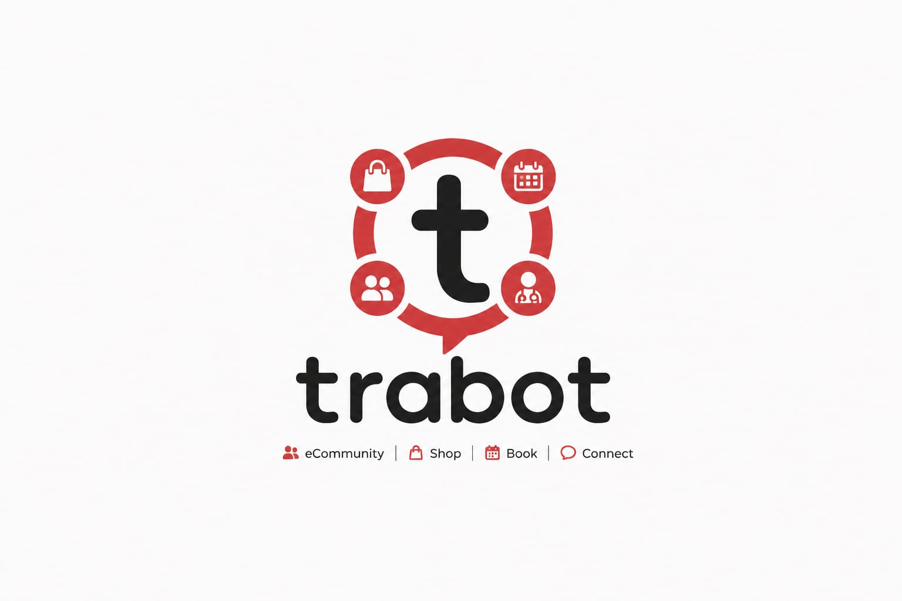

<p align="center">
  
</p>


# 🚀 Trabot Backend API

Backend implementation of **Trabot**, a comprehensive digital ecosystem that connects customers, store owners, service providers, and administrators through a unified platform.

The backend provides secure RESTful APIs for authentication, e-commerce, service booking, community management, AI-powered recommendations, real-time communication, and administrative operations.

---

# 📌 Table of Contents

* Overview
* Project Information
* API Documentation
* Backend Modules
* Technology Stack
* System Architecture
* Database
* Project Resources
* My Contributions
* Team Project

---

# 📖 Overview

**Trabot** is an all-in-one platform that combines multiple services into a single ecosystem, including:

* 🛒 E-Commerce
* 📅 Service Booking
* 👥 Community Platform
* 🤖 AI Recommendation System
* 💬 Real-time Chat
* 📦 Order & Shipment Tracking
* 📊 Dashboard & Analytics

This repository contains the **ASP.NET Core Web API** responsible for implementing the application's business logic, security, database operations, and external integrations.

---

# 🔗 Project Information

### Original Team Repository
- https://github.com/SamyMo7amed/Tradify

### API Documentation (Swagger)
- https://trabot.runasp.net/swagger/index.html

---

# ⚙️ Backend Modules

### Authentication & Security

* JWT Authentication
* Role-Based Authorization
* Email Verification
* Password Reset
* Account Management

### E-Commerce
* Seller
* Store
* Categories
* Products
* Product Variants
* Shopping Cart
* Wishlist
* Reviews & Ratings

### Orders & Shipping
* Orders
* Sub Orders
* Payments
* Shipment Management
* Shipment Tracking

### Community

* Posts
* Comments
* Replies
* Likes
* Community Interaction

### Services

* Instructor (ServiceProvider)
* Instructor Profile (Education - Certifications - Services - InstructorSchedules)
* Reviews & Ratings
* Booking System
* Appointment Management

### Communication

* Real-time Chat (SignalR)
* Email Services

### AI Integration

* AI Recommendation System
* Personalized Suggestions

### Administration

* Dashboard
* Analytics
* User Management
* Reports

---

# 🛠 Technology Stack

## Backend

* ASP.NET Core Web API
* Entity Framework Core
* SQL Server
* LINQ
* AutoMapper
* SignalR
* JWT Authentication
* localization

## External Services

* Cloudinary
* Fawaterak
* Google OAuth
* AI Recommendation Service

## Development Tools

* Visual Studio
* Git & GitHub
* Swagger (OpenAPI)
* Postman

---

# 🏛 Architecture

The project follows a clean and scalable layered architecture.

### Design Patterns

* Repository Pattern
* Unit of Work Pattern
* Dependency Injection
* Global Exception Handling
* Service Layer Architecture
* JWT Authentication
* Role-Based Authorization

### Project Structure

```text
Trabot/
├── Trabot.Api
├── Trabot.Core
├── Trabot.Data
├── Tradify.Infrastructure
├── Tradify.Service
└── Tradify.RealTimeService
```

---

# 🗄 Database

* SQL Server
* Entity Framework Core (Code First)
* Entity Relationships
* Database Migrations
* Configurations
* Optimized Queries
* Encrypted Sensitive Data

---

# 👨‍💻 My Contributions

I contributed to the backend development of several core modules and features, including:

### 🗄 Database & Backend Foundation

* Participated in database design and entity relationships.
* Implemented Entity Framework Core Code-First migrations.
* Configured database structure and data models.
* Integrated AutoMapper for object mapping.
* Implemented pagination for handling large datasets efficiently.

### 🛍 E-Commerce Modules

* Developed Seller Management APIs.
* Developed Store Management APIs.
* Developed Categories APIs.
* Developed Product Management APIs.
* Implemented Product Variants.
* Implemented Wishlist functionality.
* Implemented Reviews & Ratings.
* Developed product discovery features, including:
  - Best-selling products.
  - Top-rated products.
    
### 📦 Orders & Shipping

* Developed Order & Sub-Order management features (Update, Cancel, Retrieval, and related operations).
* Implemented Shipment Management.
* Developed Shipment Tracking functionality.

> **Note:** The Order Creation and Payment features were implemented by another team member.

### 📚 Service Marketplace

* Developed Instructor (Service Provider) module.
* Implemented Instructor Profile management (Education, Certifications, Services, and Schedules).
* Developed Booking System features.
* Implemented Appointment Management.
* Developed Reviews & Ratings for service providers.
* Developed instructor discovery features, including:
  - Top-rated instructors.
  - Personalized instructor recommendations.

### 🤖 AI Features

*Integrated the AI recommendation service into the backend.

### 📊 Dashboards & Analytics

* Developed comprehensive dashboard APIs for:

  * Admin
  * Product Sellers
  * Service Sellers
  * Instructors

* Implemented business analytics and reporting features, including:

  * Revenue analytics.
  * Orders analytics.
  * Booking analytics.
  * Dashboard summary statistics.
  * Monthly charts and trend visualization.

* Developed performance insights, including:

  * Top-selling stores.
  * Top-selling products.
  * Top-rated products.
  * Top-performing instructors.

* Implemented user dashboard features, including:

  * Order history.
  * Shipment tracking.
  * Booking history.
  * Appointment management.
  * Upcoming appointments.


### 🛠 Additional Contributions

* Swagger API Documentation.
* API Testing.
* Bug Fixes and Performance Improvements.


---

# 🤝 Team Project

This repository is a fork of the original graduation project repository.

The project was developed collaboratively by a team as part of our graduation project. 
